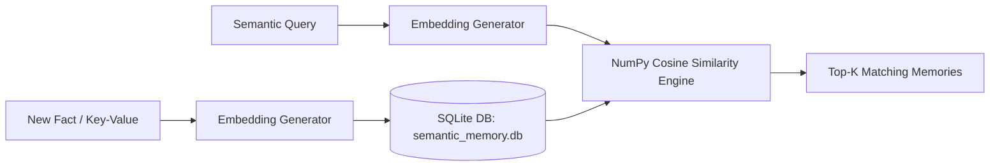

# Semantic Memory, Loop Breakers, and Tracing Implementation Plan   
   
This plan outlines the architecture for upgrading the Msty clone (`new_reactor`) with three production-grade runtime features:   
1. **Semantic/Vector-Based Long-Term Memory:** Transitioning from simple KV lookups to a local vector store built on SQLite and NumPy, supported by an adaptive embedding pipeline (using local PyTorch/Transformers or API-based endpoints).   
2. **Tool Call Limiters (Loop Breakers):** Implementing a dual-layer guardrail (Graph-level callback and client-side UI valve) to forcefully halt agents that enter recursive tool execution loops.   
3. **Arize Phoenix Observability:** Integrating standard OpenTelemetry tracing to capture and render 100% of execution trees offline via a local Arize Phoenix dashboard.   
   
All plans apply uniformly to both the GUI portion (`main.py`) and the CLI/REPL portion (`repl.py`).   
   
---   
   
## User Review Required   
   
> [!IMPORTANT]   
> **Embedding Generation Strategy:**   
> For the Semantic Memory embeddings, we propose a hybrid, adaptive strategy:   
> 1. If using **Gemini**, we will query Google's official free embedding models via `google-genai` / `langchain-google-genai`.   
> 2. If using **LMStudio** or local endpoints, we will attempt to call the `/embeddings` endpoint of the active API provider.   
> 3. If endpoints are unavailable, we will use a **local fallback embedding generator** using `transformers` and `torch` (already present in your environment), downloading a lightweight, highly optimized CPU model (like `all-MiniLM-L6-v2`) which executes in milliseconds offline.   
>   
> **Observability Port:**   
> Arize Phoenix launches a local web server at `http://localhost:6006`. If this port is occupied, we will auto-detect and fallback to an alternative open port.   
   
---   
   
## Open Questions   
   
> [!WARNING]   
> **Semantic Search Score Threshold:**   
> What strictness level would you prefer for retrieving memories?   
> We recommend a Cosine Similarity threshold of `0.70` (on a scale of -1 to 1). If memories score lower than this, they are ignored to avoid injecting noisy or irrelevant context into the agent's prompt. We can make this threshold adjustable in the Settings GUI.   
>   
> **Tool Loop Threshold:**   
> What maximum number of sequential tool calls should trigger the loop breaker?   
> We recommend a default threshold of **12 tool executions** per query turn.   
   
---   
   
## Proposed Changes   
   
### Component 1: Semantic Memory Storage & Query Pipeline   
   
We will design a local database structure that embeds and stores facts securely without external vector-database dependencies.   
   

   
#### [NEW] [semantic_memory.py](file:///home/leo/.pyvirtenvs/new_reactor/semantic_memory.py)   
A lightweight helper utility to handle database read/writes and embedding calculations:   
* **Database Setup:** Creates a `semantic_memory.db` SQLite database inside the workspace directory.   
  * Columns: `id` (int), `namespace` (text), `key` (text), `value` (text), `embedding` (blob), `timestamp` (text).   
* **Embedding Loader:** Generates vectors (float lists) adaptively:   
  * Uses `langchain_google_genai.GoogleGenAIEmbeddings` for Gemini keys.   
  * Uses `langchain_openai.OpenAIEmbeddings` mapped to `api_base` for OpenAI endpoints.   
  * Includes a local fallback using `transformers` pipeline to load `sentence-transformers/all-MiniLM-L6-v2` entirely offline.   
* **Vector Search Engine:**   
  * Computes cosine similarity via `numpy` (`np.dot` normalized).   
  * Returns top $K$ results matching `namespace` above the defined similarity score threshold.   
   
#### [MODIFY] [toolz.py](file:///home/leo/.pyvirtenvs/new_reactor/toolz.py)   
* Refactor `store_long_term_memory`, `get_long_term_memory`, and `list_memory_namespaces` to utilize `semantic_memory.py`'s SQLite engine rather than loading/writing the flat `memory_store.json` file.   
* Update `get_long_term_memory` to accept natural language query queries and perform semantic cosine search under the hood.   
   
---   
   
### Component 2: Tool Call Limiters (Loop Breakers)   
   
We will introduce a dual-layer safety valve to prevent out-of-control looping during complex multi-step reasoning runs.   
   
#### [MODIFY] [main.py](file:///home/leo/.pyvirtenvs/new_reactor/main.py)   
* **Layer A (Graph Callbacks):**   
  * Implement `ToolLoopBreakerCallback(BaseCallbackHandler)` which tracks sequential tool runs on the LangChain model.   
  * If the execution exceeds the default threshold (e.g. 12 calls), it raises a custom `ToolLoopLimitException`, halting execution gracefully and preserving checkpoints.   
* **Layer B (GUI Thread Watchdog):**   
  * In Msty's worker streaming loop, track the count of tool call updates.   
  * If exceeded, automatically trigger `self.cancel_flag = True` and emit a warning message to the chat window:   
    `"[⚠️ Execution Limit: Agent suspended. Too many repetitive tool actions detected to prevent token burn.]"`   
   
#### [MODIFY] [repl.py](file:///home/leo/.pyvirtenvs/new_reactor/repl.py)   
* Integrate the identical `ToolLoopBreakerCallback` callback class into the REPL CLI's prompt execution thread.   
   
---   
   
### Component 3: Arize Phoenix Local Tracing Integration   
   
We will wire up standard OpenTelemetry tracing to record 100% of execution structures offline.   
   
```   
Agent Action -> LangChain instrumentation -> Phoenix Local Collector (Port 6006) -> Trace Tree UI   
```   
   
#### [MODIFY] [main.py](file:///home/leo/.pyvirtenvs/new_reactor/main.py) & [repl.py](file:///home/leo/.pyvirtenvs/new_reactor/repl.py)   
* At startup, check if `"enable_phoenix_tracing"` is enabled in the active configuration JSON.   
* If enabled:   
  * Import `phoenix` and `openinference.instrumentation.langchain`.   
  * Launch the local app via `phoenix.launch_app(port=6006)`.   
  * Run `LangChainInstrumentor().instrument()` to dynamically hook into all model runs.   
* Print a console/status message: `"[📊 Local Tracing enabled. Open http://localhost:6006 in your browser to view execution traces offline]"`   
   
#### [MODIFY] [settings.py](file:///home/leo/.pyvirtenvs/new_reactor/settings.py) & [repl_settings.py](file:///home/leo/.pyvirtenvs/new_reactor/repl_settings.py)   
* Add a checkbox in the **Preferences** tab to allow the user to toggle "Enable Arize Phoenix Tracing" on/off easily from the interface.   
   
---   
   
## Verification Plan   
   
### Automated & Manual Verification   
1. **Semantic Memory Testing:**   
   * Invoke `store_long_term_memory` to store diverse facts (e.g., `"user prefers dark theme in Msty"`, `"nginx config folder is /etc/nginx"`).   
   * Verify that SQLite stores these facts along with valid high-dimensional binary blobs representing embeddings.   
   * Run semantic queries (e.g., `"find system directories"`) and ensure it correctly surfaces the nginx path as the highest similarity match using cosine calculations.   
2. **Loop Breaker Verification:**   
   * Construct a dummy subagent in `subagents.py` that repeatedly triggers an error tool (creating a loop).   
   * Run the agent and verify that exactly when the counter hits the threshold, the callback raises an exception, the execution thread gracefully halts, and the GUI warns the user.   
3. **Observability Verification:**   
   * Launch `new_reactor` with tracing enabled.   
   * Open `http://localhost:6006` in a web browser.   
   * Send a standard chat message that triggers planning and tool runs.   
   * Verify that the local Phoenix dashboard displays an interactive parent-child tree showing all LLM prompts, intermediate reasoning, tool parameters, and tool return data.   
