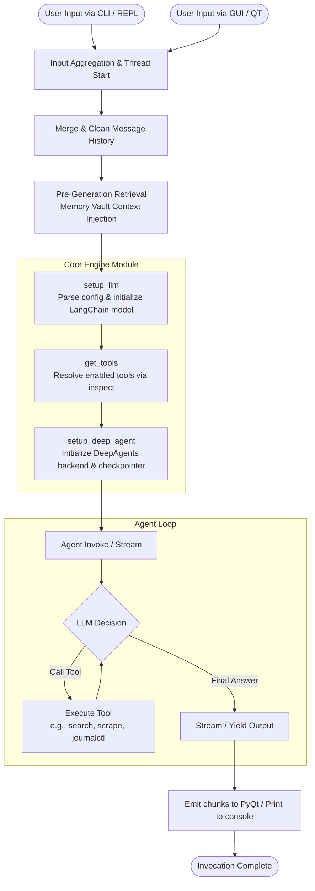

# New Reactor Invocation Flowchart

This flowchart illustrates the step-by-step process of a typical LLM generation invocation following our recent architecture overhaul, showing how the GUI and CLI now uniformly interface with the core engine.

