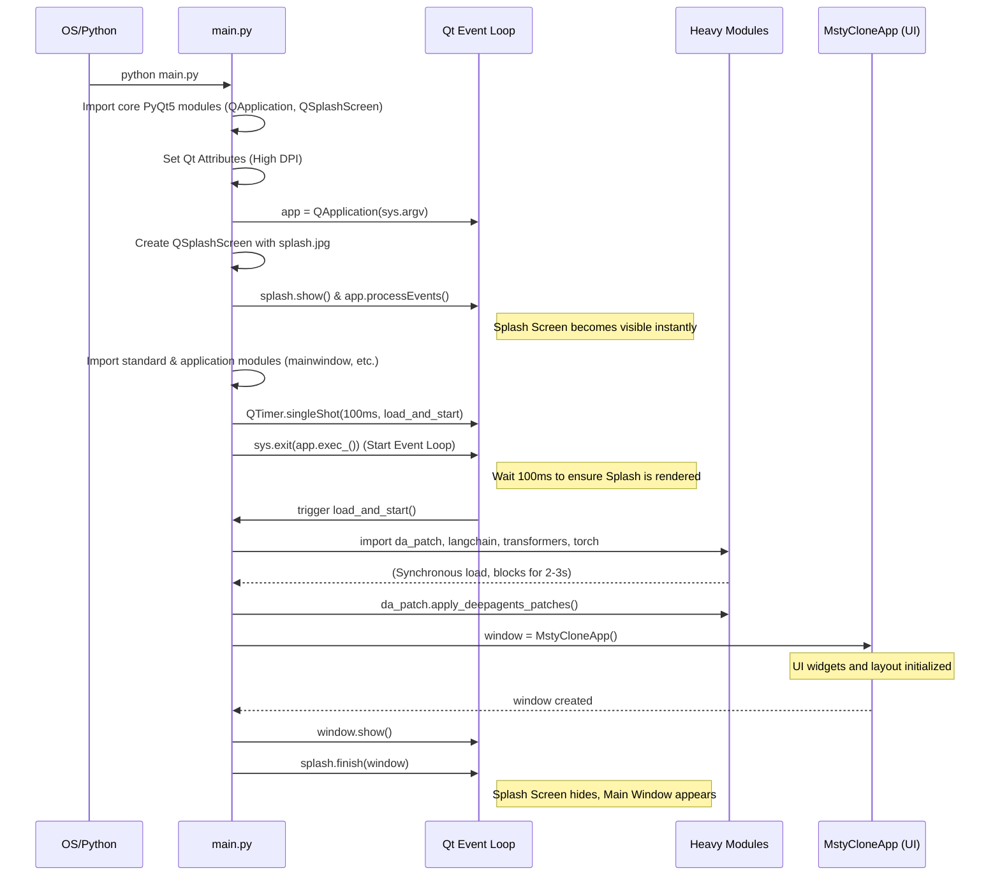
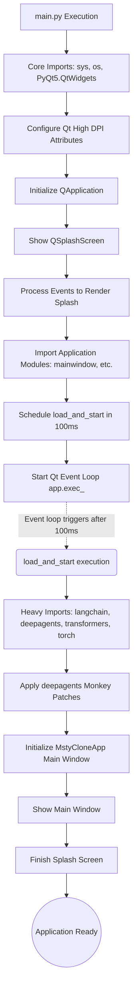

# Startup Flowchart & Module Loading Sequence

This document details the exact loading sequence and module initialization flow of `new_reactor` when executed.

## Execution Timeline

The startup of the application is specifically optimized to show the user a splash screen instantaneously by deferring heavy backend imports until after the GUI has been drawn by the operating system.

## Module Dependency Graph

This flowchart illustrates how the code pathways behave sequentially from execution to completion of the application loading sequence.

## Key Optimizations Noted
- **Deferred Heavy Imports:** Dependencies like `langchain`, `transformers`, and `deepagents` are isolated in `load_and_start()`.
- **Dynamic Thread Imports:** `GenerationThread` is intentionally not imported at the top-level of `mainwindow.py` to prevent cascading heavy imports during UI initializations.
- **Instant Paint:** `QApplication.processEvents()` is called immediately after `splash.show()` to bypass GIL lockups and enforce a render of the splash screen.
